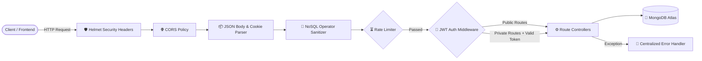

<div align="center">

# 📇 Contacts Management System — REST API

<p align="center">
  <strong>A production-ready, secure, and scalable RESTful API built for multi-user contact management.</strong>
</p>

[](https://nodejs.org/)
[](https://expressjs.com/)
[](https://www.mongodb.com/)
[](https://jwt.io/)
[](https://vercel.com/)
[](LICENSE)

</div>

---

## 📋 Overview

The **Contacts Management System API** provides a secure backend for managing private contact lists with isolated user accounts. It implements defense-in-depth security, dual-token authentication (short-lived access tokens with rotating refresh tokens), rate limiting, NoSQL injection sanitization, and is optimized for serverless deployments.

---

## 🏗️ Architecture & Request Flow



---

## 🚀 Key Features

### 🔐 Security & Authentication
- **Dual-Token Authentication**: Short-lived (15m) JWT access tokens paired with long-lived (7d) refresh tokens delivered via HTTP-only cookies.
- **NoSQL Injection Defense**: Custom recursive sanitization middleware designed for Express 5 that neutralizes MongoDB operators (`$`, `.`) in request payloads.
- **Tiered Rate Limiting**: Global rate limiting (100 req/15m) alongside strict rate limiting (10 req/15m) for sensitive authentication endpoints.
- **Security Headers**: Powered by `Helmet` for CSP, HSTS, clickjacking defense, and MIME-type sniffing protection.
- **Password Protection**: Hashed using `Bcrypt` with salted rounds.

### 👥 Multi-User Isolation & Data Integrity
- **Private Data Sandboxing**: Strict ownership validation ensures users can only access and modify their own contacts.
- **Scoped Deduplication**: Contact uniqueness (email/phone) is enforced per user account.
- **Cascade Deletion**: Completely removes associated contacts upon user account deletion.
- **Input Validation**: Centralized regex validation for passwords, emails, contact names, and phone numbers.

### ⚡ Infrastructure & Error Handling
- **Serverless Optimized**: Mongoose connection caching to prevent connection exhaustion during cold and warm starts on Vercel.
- **Centralized Error Dispatcher**: Unified error formatting with dedicated handling for Mongoose `CastError`, `ValidationError`, and duplicate key errors.
- **Environment Driven**: Fully configurable through standard `.env` variables.

---

## 🔌 API Reference

Base URL: `/api`

### 👤 Authentication & User Endpoints (`/api/users`)

| Method | Endpoint | Description | Auth | Rate Limit |
| :--- | :--- | :--- | :---: | :---: |
| `POST` | `/register` | Register a new user account | Public | Strict |
| `POST` | `/login` | Authenticate user & issue access/refresh tokens | Public | Strict |
| `POST` | `/refresh` | Issue new access token using refresh cookie | Public | Global |
| `GET` | `/profile` | Retrieve authenticated user profile | Private | Global |
| `PUT` | `/profile` | Update username or email | Private | Global |
| `PUT` | `/change-password` | Change account password | Private | Strict |
| `POST` | `/logout` | Invalidate refresh token and clear cookies | Private | Global |
| `DELETE` | `/profile` | Delete account and all associated contacts | Private | Global |

### 📇 Contact Endpoints (`/api/contacts`)

| Method | Endpoint | Description | Auth | Rate Limit |
| :--- | :--- | :--- | :---: | :---: |
| `GET` | `/` | Retrieve all contacts for authenticated user | Private | Global |
| `POST` | `/` | Create a new contact | Private | Strict |
| `GET` | `/:id` | Get details for a specific contact | Private | Global |
| `PUT` | `/:id` | Update contact information (partial / full) | Private | Strict |
| `DELETE` | `/:id` | Permanently remove a contact | Private | Strict |

---

## 🛠️ Tech Stack

- **Runtime**: [Node.js](https://nodejs.org/) (ES Modules)
- **Framework**: [Express.js v5](https://expressjs.com/)
- **Database**: [MongoDB](https://www.mongodb.com/) with [Mongoose v9](https://mongoosejs.com/)
- **Authentication**: [JSON Web Tokens (jsonwebtoken)](https://github.com/auth0/node-jsonwebtoken) & [Bcrypt](https://github.com/kelektiv/node.bcrypt.js)
- **Security & Utilities**: [Helmet](https://helmetjs.github.io/), [express-rate-limit](https://github.com/express-rate-limit/express-rate-limit), [cookie-parser](https://github.com/expressjs/cookie-parser), [cors](https://github.com/expressjs/cors)
- **Deployment**: [Vercel](https://vercel.com/) (Serverless)

---

## 📂 Project Structure

```text
contacts-management-system-backend/
├── 📁 config/              # Database connection & pooling configuration
│   └── dbConnection.js
├── 📁 controllers/         # Core business logic for users & contacts
│   ├── contactControllers.js
│   └── userControllers.js
├── 📁 middleware/          # Security, auth verification, & error middleware
│   ├── errorHandler.js
│   ├── rateLimiter.js
│   ├── sanitize.js
│   └── validateTokenHandler.js
├── 📁 models/              # Mongoose data schemas (User & Contact)
│   ├── contactModel.js
│   └── userModel.js
├── 📁 routes/              # Express route declarations
│   ├── contactRoutes.js
│   └── userRoutes.js
├── 📁 utils/               # Centralized validation & shared utilities
│   └── validation.js
├── 📄 constants.js         # HTTP status code definitions
├── 📄 server.js            # Express application entry point
├── 📄 vercel.json          # Serverless deployment configuration
└── 📄 package.json         # Project metadata & dependencies
```

---

## 🌐 Deployment (Vercel)

This application is ready for serverless deployment on **Vercel**:

1. Push your repository to GitHub.
2. Import the repository in your [Vercel Dashboard](https://vercel.com/).
3. Add your Environment Variables (`CONNECTION_STRING`, `ACCESS_TOKEN_SECRET`, `REFRESH_TOKEN_SECRET`, `NODE_ENV=production`, `FRONTEND_URL`).
4. Click **Deploy**. Vercel will automatically configure the build using [vercel.json](file:///home/veronica/Desktop/contacts-management-system-backend/vercel.json).

---

<div align="center">
  <sub>Maintained by <a href="https://github.com/Swadesh-c0de"><strong>Swadesh-c0de</strong></a></sub>
</div>